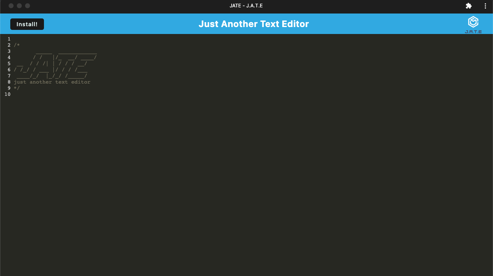

# Text Editor PWA

#### Daniel Alexander Hernandez

 

## Technologies Used
<ul>
<li>Express</li>
<li>Node.js</li>
<li>Webpack</li>
<li>IndexedDB</li>
</ul>

 

## Description
This project was designed to be a simple text editor that can either be used in a browser or in an installed application. If changes in the code are done either through the webpage or through the app, the changes will be carried over and saved on both sides.
 

## Installation
To use the application, you can visit the deployed Heroku link listed below. Once you visit the link, you can either use to app natively on the webpage or click the install button to have the app installed onto your computer and run the app through there.

https://glacial-headland-80951.herokuapp.com/
 

## Usage
One can use this app like anyother text editor. 

